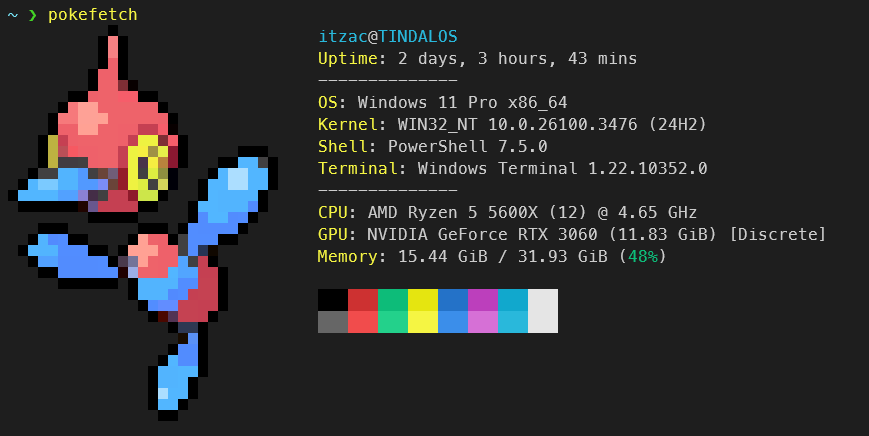

# pokefetch Tutorial
 Use pokeget-rs on fastfetch with a guided tutorial! 



# Dependencies

`pokeget-rs` at [talwatpokeget-rs](https://github.com/talwat/pokeget-rs)

`fastfetch` at [fastfetch-cli/fastfetch](https://github.com/fastfetch-cli/fastfetch)

# Fastfetch installation

Install `fastfetch` using your distro's package manager.
|Distro| Command               |
|------|-----------------------|
|Arch  | `pacman -S fastfetch` |
|Debian/Ubuntu| `apt install fastfetch`|
|Fedora| `dnf install fastfetch`|
|Windows (WinGet)| `winget install Fastfetch-cli.Fastfetch`|

* Super user privilages may be required to install.

 # Pokeget-rs installation

 Requires `cargo`, located in the [rust-lang/rust](https://github.com/rust-lang/rust) repo.

 |Distro| Command               |
|------|-----------------------|
|Arch  | `pacman -S cargo` |
|Debian/Ubuntu| `apt install cargo`|
|Fedora| `dnf install cargo`|
|Windows| [rustup (rust-lang.org)](https://www.rust-lang.org/tools/install)|

Install `pokeget-rs` via `cargo`.

`cargo install pokeget`

Upon installation, you may get a message like this.

```
warning: be sure to add "/home/user/.cargo/bin" to your PATH to be able to run the installed binaries
```

This is because your `.bashrc` or `.zshrc` needs to adopt the path to the pokeget binary. To fix this,

1. Open your `.bashrc` or `.zshrc` file
2. Append `export PATH="<path>:$PATH"` to it. (`<path>` is the path to the binary, `/home/user/.cargo/bin`)
3. Save, exit, and restart your terminal emulator.

# Main tutorial

# Linux

(Make sure you've added pokeget to your `.bashrc`.)

1. Open your `.bashrc` file.
2. Insert the following string into the file.
```
alias pokefetch="pokeget <pokemon> <flags> --hide-name | fastfetch --file-raw -"
```
3. Save, exit, and restart your shell.
4. Execute `pokefetch`.

# Windows

Make or edit your Windows Powershell profile file.

1. (Optional) Type `New-Item -Path $profile -Type File -Force` to make a profile.
2. Open your Powershell file. `notepad.exe $PROFILE`
3. Insert the following string into the file.
```
function Call-Pokefetch {
	pokeget <pokemon> <flags> --hide-name | fastfetch --file-raw -
}

Set-Alias pokefetch Call-Pokefetch
```
4. Save, exit, and restart your shell.
5. Execute `pokefetch`.

# FAQ

1. The rendering of the Pokemon is broken on Powershell!!

This is due to using an old version of Powershell. Install the latest Powershell from Microsoft and execute it there.

# Why make this tutorial?
I wanted to get more used to how GitHub works, as well as try my hand at building a quick tutorial for something I had to work out myself.

This was all typed stream-of-conciousness, so if there's anything wrong, please let me know or create a pull request.

# Credits

Thanks to [talwatpokeget-rs](https://github.com/talwat/pokeget-rs) and [fastfetch-cli/fastfetch](https://github.com/fastfetch-cli/fastfetch) for making these awesome tools.